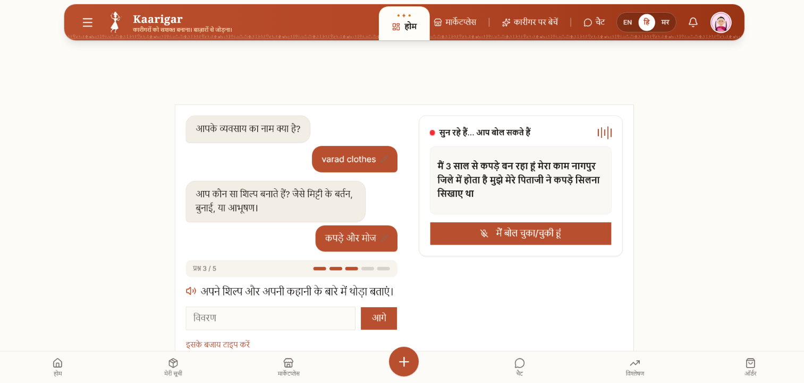
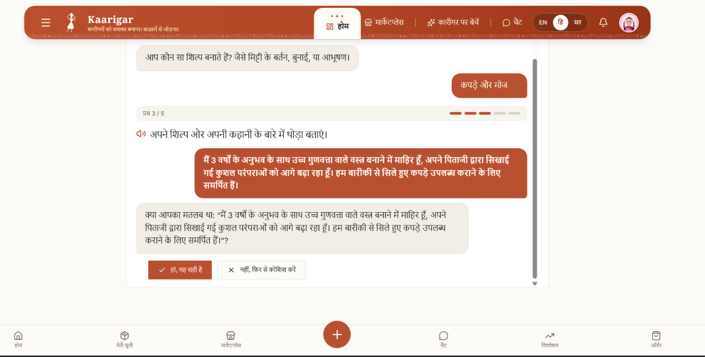
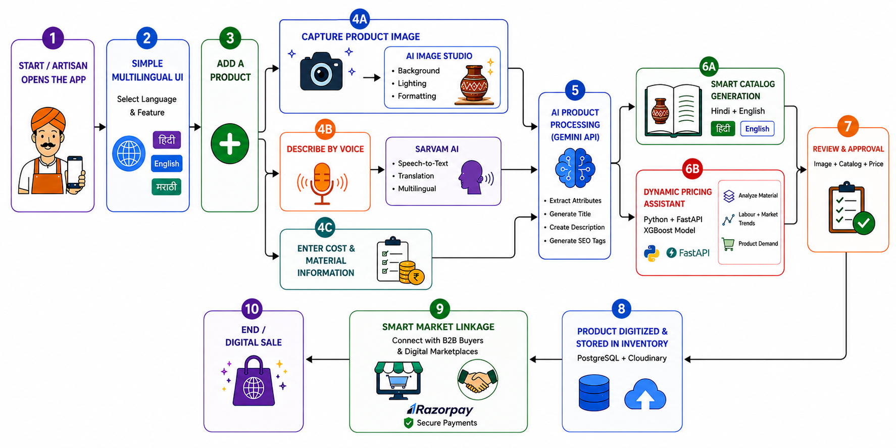

<div align="center">

# Kaarigar

**Voice-first market linkage for Indian artisans.** Speak about the craft — get a bilingual, SEO-ready listing, a price band, and a live storefront after human review.

[](https://nextjs.org)
[](https://expo.dev)
[](https://www.typescriptlang.org)
[](https://fastapi.tiangolo.com)
[](https://neon.tech)

<br />


</div>

---

## Screenshots

<table>
  <tr>
    <td width="50%" align="center">
      
      <br />
      <sub><b>Voice QnA</b> — artisan onboarding in Hindi / English / Marathi</sub>
    </td>
    <td width="50%" align="center">
      
      <br />
      <sub><b>Gemini + NLP</b> — transcript cleanup, catalog copy, confirmation</sub>
    </td>
  </tr>
</table>

<p align="center">
  
  <br />
  <sub>Capture → Sarvam STT → Gemini catalog → pricing model → review → inventory → Razorpay</sub>
</p>

---

## What you get

An artisan opens the **web** or **mobile** app, picks a language, photographs the product, and describes it by voice. Kaarigar turns that into a listing (title, description, SEO tags, price suggestion). After admin approval it goes live on an IndiaMART-style marketplace — buyers browse, chat, and pay a 10% advance.

| Layer | Role |
| --- | --- |
| **Web** (`apps/web`) | Next.js marketplace, onboarding, admin queue, payments |
| **Mobile** (`apps/mobile`) | Expo / React Native app — same flows on device |
| **ML** (`apps/ml_service`) | FastAPI pricing model + optional Indic ASR |

Every third-party key is optional. The app boots with only `DATABASE_URL`; OTP, speech, Gemini, Cloudinary, Razorpay, and Pusher each have a documented fallback.

---

## Tech stack

<p align="center">
  
</p>

| Area | Stack |
| --- | --- |
| Web | Next.js 16 (App Router, Turbopack), React 19, TypeScript, Tailwind v4 |
| Mobile | Expo 57, React Native, Expo Router |
| API / data | Neon Postgres, Drizzle ORM, Zod |
| Auth | Phone + WhatsApp OTP (Renflair), optional Google / GitHub OAuth, JWT |
| Voice & AI | Sarvam AI → Gemini → Python ML → Web Speech / `speechSynthesis` |
| Pricing | scikit-learn (FastAPI) → rules engine → optional Gemini rationale |
| Media | Cloudinary + client WASM background removal |
| Chat / pay | Pusher Channels, Razorpay (10% advance) |

---

## Quick start

**One command from the repo root** (Windows). It checks `DATABASE_URL`, starts the ML service if a venv exists, boots Next.js, and opens the browser:

```powershell
.\dev.ps1
```

### First-time setup

```powershell
# 1. Web
cd apps/web
npm install
Copy-Item .env.example .env.local   # set DATABASE_URL (Neon)
npm run db:migrate
npm run db:seed                     # demo businesses + admin phones
cd ../..

# 2. Run everything
.\dev.ps1
```

Open [http://localhost:3000](http://localhost:3000) → redirects to `/en`. Hindi: `/hi`.

Without OTP keys, codes print in the **server console** (and a dev banner), so you can complete login → onboard → admin approve → marketplace with zero external accounts.

| Command | Where | What |
| --- | --- | --- |
| `.\dev.ps1` | repo root | Web + ML (if venv) + browser |
| `npm run dev` | `apps/web` | Next.js only |
| `npx expo start` | `apps/mobile` | Expo Go / simulator |
| `uvicorn app.main:app --reload --port 8000` | `apps/ml_service` | Pricing + optional ASR |

**Admin:** log in with a number from `ADMIN_PHONE_NUMBERS` (seeded by `db:seed`), then open `/admin`.

**ML (optional):** pricing falls back to the rules engine if this is down.

```powershell
cd apps/ml_service
python -m venv .venv
.\.venv\Scripts\Activate.ps1
pip install -r requirements.txt
python train.py
uvicorn app.main:app --reload --port 8000
```

Set `ML_SERVICE_URL=http://localhost:8000` in `apps/web/.env.local`. If PowerShell blocks activation: `Set-ExecutionPolicy -ExecutionPolicy RemoteSigned -Scope CurrentUser`.

---

## Mobile app

`apps/mobile` is a first-class **Expo** app (not a placeholder): camera, microphone, catalog, chat, NLP price estimator, Cloudinary upload. Point it at the same Next.js API.

```powershell
cd apps/mobile
npm install
Copy-Item .env.example .env
npx expo start
```

| Path | Purpose |
| --- | --- |
| `apps/mobile/app/` | Expo Router screens (`(auth)`, `(tabs)`, catalog, chat) |
| `apps/mobile/src/lib/` | API client, auth, voice, Cloudinary |
| `apps/mobile/src/components/` | Product cards, QnA, price estimator |
| `apps/mobile/eas.json` | EAS Build (`com.kaarigar.mobile`) |

Web domain logic in `apps/web/src/core/` has no React / Next / Drizzle imports so the same policies can move to Expo without a rewrite.

---

## Folder structure

```
Kaarigar/
├── apps/
│   ├── web/                 # Next.js 16 → Vercel
│   │   └── src/
│   │       ├── app/         # Pages + thin API routes
│   │       ├── core/        # Domain logic (portable to Expo)
│   │       ├── infra/       # DB, SMS, speech, AI, payments, ML
│   │       └── components/  # UI + feature components
│   ├── mobile/              # Expo / React Native
│   └── ml_service/          # FastAPI pricing + optional ASR → Render
├── repo-assets/             # Demo video, flowchart, screenshots
├── dev.ps1                  # One-command local start
└── README.md
```

| App | Deploy root | Host |
| --- | --- | --- |
| Web | `apps/web` | Vercel |
| ML | `apps/ml_service` | Render / Fly / Docker (persistent process) |
| Mobile | `apps/mobile` | EAS / Expo |

Use a matching `ML_SERVICE_API_KEY` on web and ML when the Python service is public.

---

## Env (minimum)

Copy `apps/web/.env.example` → `.env.local`. **Required:** `DATABASE_URL`. Everything else degrades.

| Variable | If missing |
| --- | --- |
| `DATABASE_URL` | App will not start |
| `RENFLAIR_WHATSAPP_API_KEY` | OTP in console / dev banner |
| `SARVAM_API_KEY` | Next STT tier, then Web Speech |
| `GEMINI_API_KEY` | Keyword / rules fallback |
| `CLOUDINARY_*` | Photo upload disabled (clear UI) |
| `RAZORPAY_*` | Advance pay shows “not set up” |
| `PUSHER_*` | Chat polls instead of live push |
| `ML_SERVICE_URL` | Rules engine only |

---

## Tests & checks

```powershell
cd apps/web
npm run test        # vitest — domain only, no DB/network
npm run typecheck
npm run lint
npm run build
```
